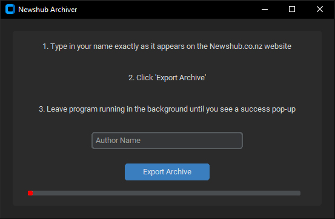

# The Newshub Archiver

The purpose of this project was to allow reporters to obtain PDF copies of their articles before the Newshub website went offline. At the time of development, it was not yet known that Stuff would purchase and rehost the Newshub web archive.

The tool was intended for personal archival use, allowing reporters to retain copies of their own published work.

---

# Link Crawler

The Link Crawler parses the Newshub sitemap using BeautifulSoup and saves all reachable links into a CSV file.

The resulting CSV was manually processed to remove duplicates and irrelevant links such as category pages. The cleaned list was then saved as a `.txt` file for later processing.

---

# Article Dumper

The Article Dumper processes the link list and extracts:
- URL
- Article title
- Author(s)

It relies on HTML classes identified through Chrome DevTools, alongside prior experience working with the Newshub website while employed as a journalist.

The extraction process has several stages.

## 1. Checking for Authors

If the `authorName` class is populated, the code extracts the author name(s) directly from the current CMS structure and returns them alongside the article title.

## 2. Checking the Promo Tag

Due to quirks from an older CMS migration, stories published before a certain date contain the promo tag `"Breaking"`.

If this tag is present, the code checks the first line of the article body for the word `"By"`. If found, the following text is extracted as the author name.

## 3. No Authors Found

If neither method identifies an author, the article is treated as authorless and returned with a blank author field, allowing for easy filtering later.

---

# Newshub Archiver GUI

The final application is a distributable GUI built for end users.

Users enter their name and the program searches for all matching stories, including articles with multiple reporters. As stories are exported, the GUI displays a progress indicator based on the number of matching articles found.

The interface was built using CustomTkinter, while `wkhtmltopdf` is used to convert web pages into PDF files.
